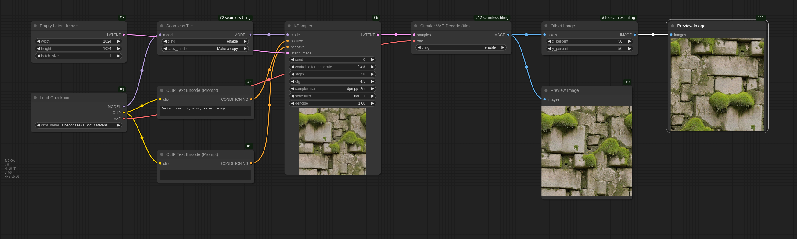

# ComfyUI-seamless-tiling

Example workflow:


ComfyUI nodes for generating seamless textures. Replicates "Tiling" option from A1111, including independent X/Y tiling.

Use "Seamless Tile" node between loader and samplers to modify model, and "Make Circular VAE" or "Circular VAE Decode" node to decode image. (Make Circular VAE is more efficient, since it only modifies the VAE model once instead of on each decode)

"Offset Image" node to check for seams.

Circular VAE Decode code from https://github.com/FlyingFireCo/tiled_ksampler

X/Y tiling implementation modified from https://github.com/tjm35/asymmetric-tiling-sd-webui

```
conditioning/Seamless Tile  
latent/Circular VAE Decode (tile)  
latent/Make Circular VAE  
image/Offset Image  
```
